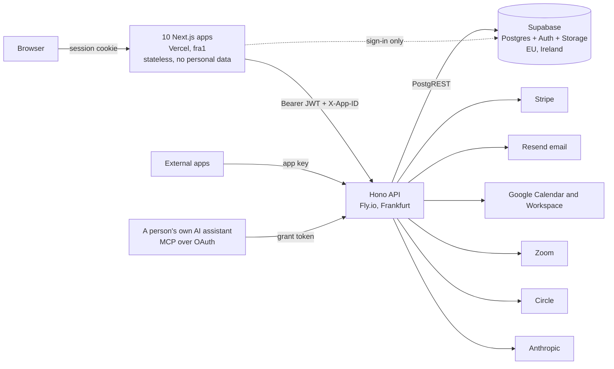

# Technical overview

For an engineer or a technical partner meeting this system for the first
time: what it is, what it is built from, how big it is, how it is run, what
is solid and what is fragile. Every number here was measured from the
repository at v1.96.2 on 2026-10-01; none was copied from an older document.

If you are about to change code, read `docs/system-handbook.md` next. This
document is the summary; that one is the manual.

## 1. What it is

**The Thread** is a family of web apps for people who run learning journeys,
events, communities and the relationships around them. It is operated by
Solidarity Lab B.V. in Rotterdam, hosted in the EU, and designed around the
GDPR from the first migration. "The Fibre" is the platform underneath and the
name of the repository.

One platform holds identity, contacts, organisations, consent, billing and an
activity log. Each app owns its own content and reads the platform for
everything else.

| App | What it does | Production |
|---|---|---|
| The Fibre | The platform: contacts, organisations, workspaces, members, teams, plans, admin | thefibre.app |
| The Thread | Learning journeys and events: public pages, tickets, payments, scheduled messages, certificates, website embeds | app.thethread.app |
| Meet | Scheduling: meeting types, polls, paid bookings, Google Calendar, Zoom | meet.thethread.app |
| Members | Community subscriptions: tiers, renewals, access to Thread, Circle and Google Workspace | membership.thethread.app |
| Connect | A community landscape: where everybody stands and who needs attention | connect.thethread.app |
| Flow | People-flow pipelines with gates and tasks, and a visual builder | flow.thethread.app |
| Pulse | Business planner: cashflow, commitments, budgets | pulse.thethread.app |
| Models | Business model generators per team (beta) | models.thethread.app |
| My Thread | A participant's own page across every app: tickets, memberships, invoices, calendar | my.thethread.app |
| Website | Marketing | thethread.app |

A full second stack mirrors production on `thefibre.tech`. The system is in
production use by its operator, a first community (soul.com) and an external
app built by a third party against the published API (a festival planner),
which is why that API is treated as a contract.

## 2. Architecture

- **One API, ten stateless frontends.** The frontends talk to Supabase only
  to sign in. Every read and write of data goes through the API, so personal
  data never sits in the frontend host.
- **Multi-tenant by workspace.** Row-level security is on every table. An
  anonymous or foreign session reads nothing, and a test proves that for
  every table on each run.
- **Tenancy inside the API is mostly hand-written.** Most routes use the
  service-role database client, which bypasses row-level security, and filter
  by workspace in code. This is the single most important thing for a new
  maintainer to understand; section 8 says what has been done about it.
- **The data wall.** Apps do not read each other's content. They write across
  the boundary in two places only: an append-only activity log (type and
  subject, never content) and a money ledger. Three surfaces read across it
  on purpose, because their job is one person's cross-app view.
- **No queue and no worker.** Background work is seven in-process jobs on a
  five-minute tick, each under a database lease so two API machines never run
  the same job.
- **Two apex domains.** The platform is on `thefibre.app`, everything else on
  `thethread.app`. A cookie cannot span them, so sessions cross through a
  short-lived, single-use hand-off code.

## 3. Stack

| Layer | Choice | Version in the lockfile |
|---|---|---|
| Language | TypeScript, strict, with `noUncheckedIndexedAccess` and `exactOptionalPropertyTypes` | 5.9 |
| Runtime | Node | 22 |
| Package manager | pnpm workspaces (monorepo) | 9.12 |
| Frontend | Next.js App Router, React, Tailwind | 15.5, 19.2, 3.4 |
| API | Hono on Node | 4.12 |
| Database and auth | Supabase: Postgres 15, Auth, Storage, PostgREST | supabase-js 2.105 |
| Validation | Zod | 3.25 |
| Payments | Stripe: Checkout, Connect, Billing | stripe 22.1 |
| Email | Resend, called over plain HTTP | no SDK |
| Tests | Vitest, Playwright | 5.0, 1.63 |
| AI | Anthropic SDK (in-app assistant), Model Context Protocol SDK | 0.126, 1.30 |
| Other | pdfkit (invoices), passkit-generator (Apple Wallet), googleapis, @xyflow/react (Flow canvas) | |

There is no ORM and no direct Postgres driver: the API reaches the database
through the Supabase client over HTTP. There is no ESLint or Prettier
configuration; consistency rests on the type system, shared components and
review.

## 4. Size

| | |
|---|---|
| TypeScript, apps and packages | about 250,000 lines, of which about 44,000 are translation catalogs |
| API | 66,000 lines, 57 route modules, about 510 endpoints |
| Database | 235 migrations, 141 tables, 222 row-level-security policies, 53 privileged functions |
| Tests | 126 unit test files, 21 integration files, 7 end-to-end files |
| Documentation | about 100 files, 25,000 lines; the changelog is another 22,000 |
| History | 1,333 commits since 2026-05-12; about 850 releases; 920 commits in September 2026 alone |
| Languages | English, Dutch, Spanish, Portuguese, German, French |

Two API modules are very large: the Thread routes at 7,300 lines and the Meet
routes at 5,700.

## 5. How it is built and run

**It has been built by one person directing many AI coding sessions in
parallel.** That explains the pace, the volume of written reasoning, and
several of the controls below, which exist because several sessions work in
one repository at once.

**Releasing.**

1. Work happens on a branch in a private git worktree.
2. To land, a session requests a clearance (`scripts/runway.sh`). One
   controller grants one clearance at a time, after checking the commit is
   built on current staging and its migrations do not collide.
3. `scripts/release.sh` checks the version surfaces, runs the gate
   (`pnpm verify`: typecheck, unit tests, a production smoke test and a
   published-contract check) and pushes to the `staging` branch. Vercel
   builds the staging apps from it.
4. Migrations are applied to staging with a script, and the API is deployed
   to staging with a guarded script, as separate steps.
5. Production is a deliberate promotion of a staging commit, with migrations
   first. It moves only on the owner's explicit word, which the tooling
   records.

Every release has a narrative changelog entry that says why. There are no git
tags; the changelog and the commit subjects carry the version.

**Hosting.**

| Piece | Where | Notes |
|---|---|---|
| Web apps | Vercel, ten projects, Frankfurt | A build runs only when that app, the shared package or the lockfile changed |
| API | Fly.io, Frankfurt, a small shared-CPU machine per stack (1 GB production, 512 MB staging) | Blue-green deploys; health check on `/health` |
| Database, auth, storage | Supabase, Ireland, one project per stack | Migrations applied by hand with a script |
| DNS | TransIP | |
| Email | Resend | Also carries Supabase's own auth emails |

**Checks that run without a person.** CI on every push runs typecheck, unit
tests and a build of the platform app and the API. A nightly job smoke-tests
both stacks. Dependabot proposes weekly minor and patch updates; major
versions are ignored on purpose.

**Checks that need a person or a session.** The integration suite runs
against the real staging database and the end-to-end suite against the
staging stack; neither is in CI, because they need staging credentials. A
periodic "stress round" runs every layer, both stacks' security audits and
targeted hunts, and writes a dated record (`docs/stress-test-*.md`).

## 6. Data and tenancy

`docs/data-model.md` maps every table. The essentials:

- A **workspace** is the tenant. A **person** is a contact; a **user** is a
  sign-in seat. One human in three workspaces is three user rows joined by
  email.
- Access has four layers: a role in the workspace, the workspace having
  switched an app on, the user holding a seat for that app, and teams that
  hand out seats.
- Personal data is soft-deleted, never removed in place. The activity log is
  append-only and a database trigger enforces that even against the service
  role.
- Money is recorded in one ledger table. Stripe is the rail; the ledger is
  the record. Invoices, receipts and fee statements render from the ledger.
- Every field on a person exists because a named app needs it, and a user
  only sees the fields of apps they hold a seat for.

## 7. Integrations

| Service | Used for | State |
|---|---|---|
| Stripe | Ticket and booking checkout on connected accounts, membership subscriptions, platform plans, a plan-aware platform fee | Live. Four signed webhooks. Connect onboarding by OAuth is built and switches on when a client id is configured; until then an account id is pasted |
| Google | Sign-in; per-user Calendar for availability; Workspace admin for member accounts; Wallet passes | Live; Wallet passes need issuer credentials |
| Zoom | Real meetings for bookings and sessions | As of 2026-10-01: working on staging with a development-mode app; off in production until Zoom's review; its deauthorisation webhook is built and tested but has never been called by Zoom |
| Circle | Community sign-in through the platform as OAuth provider; member access sync | Built and verified against a real Circle community |
| Resend | All transactional email | Live |
| Anthropic | An in-app assistant with an approval gate | Built; on wherever a key is set (the platform's, or a workspace's own) |
| MCP | A person connects their own AI assistant, which then acts as them within granted scopes | Live |
| External apps | A published, additive-only API with scoped keys | One third-party app in production |

"Live" here means the code path is in production. Whether a given credential
is set on a given stack is a fact of that stack's secrets, not of this
repository: read `fly secrets list` and the Vercel project settings.

## 8. Quality and security posture

**What is solid.**

- A strict type system, including typed translation catalogs: a missing
  translation is a compile error.
- Executable contract checks for everything promised to outsiders: the
  external-app API, the public read API, the Stripe webhook configuration,
  the assistant sign-in flow.
- Tenancy tests that attack from a second workspace, run against a real
  database, never a mock.
- A derived anonymous-access floor: every table in the migrations is probed
  as an anonymous client on each run.
- Privileged database functions are closed by default and probed against a
  reviewed allowlist.
- Security headers on every app and the API, a default-deny CORS list derived
  from the app registry, rate brakes on public endpoints, signature checks on
  every webhook.
- A written incident record. Each incident added a rule, and the rule sits
  beside its reason (`docs/system-handbook.md` §10 and §11,
  `docs/testing-approach.md`).

**What is known to be weak.** This list is deliberate; a partner should hear
it from us.

1. **No error tracking and no alerting.** Logs go to Fly's standard output.
   A fault is noticed when someone looks, or when a user says so.
2. **Service-role tenancy.** The API's hand-written workspace filters are the
   real boundary on most routes. Two cross-workspace holes of this shape were
   found and closed in September 2026, both by review rather than by a tool.
   There is no lint or test that proves every route has its filter.
3. **A single API machine per stack**, in-process schedulers, and in-memory
   rate limits. It is adequate for today's load and it is a ceiling.
4. **Coverage is uneven by design.** The API, the shared package and Connect
   carry the unit tests. Seven of the ten web apps have none and rely on
   types, render checks and the end-to-end suite.
5. **Integration and end-to-end tests are outside CI.** CI builds two of the
   eleven deployables.
6. **Two very large route modules** (Thread and Meet) and about 3,800 lines
   of byte-identical per-app boilerplate that should live in the shared
   package.
7. **Four of six languages are machine-drafted** and marked for review.
8. **The security roadmap's second tier is not done**: a content security
   policy, multi-factor sign-in for admins, log redaction, an admin audit
   table, a replay guard on Stripe events, a backup and restore drill. Third
   party refresh tokens (Google, Zoom, Circle) are stored in service-role-only
   tables but not encrypted at rest. `docs/data-protection-approach.md` has
   the full list and its status.
9. **GDPR machinery is partial.** Consent, soft delete, the request intake
   and a data export exist; the export does not yet cover every app's data,
   erasure is a manual queue, and retention policies have tables but no job.
   The privacy policy and terms have not been reviewed by a lawyer.
10. **Bus factor of one.** The owner holds every account and every production
    decision.
11. **Migrations and API deploys are manual steps** around the release, in a
    documented order.

## 9. What a maintainer needs access to

| Account | For |
|---|---|
| GitHub `findingthesoul/thefibre` | The repository, CI, Dependabot |
| Vercel (ten projects) | Web deploys, environment variables, domains |
| Fly.io (`thefibre-api`, `thefibre-api-staging`) | The API, its secrets and logs |
| Supabase (two projects) | Database, auth settings, the token hook, storage |
| Stripe (live and a sandbox) | Payments, webhooks, Connect |
| Resend | Email |
| Google Cloud | OAuth client, Calendar and Wallet credentials |
| Zoom Marketplace | The Zoom app |
| TransIP | DNS |
| Anthropic | The assistant's platform key |

Environment variable names are listed in `docs/deploy.md` and
`docs/environments.md`; `scripts/verify-vercel-env.mjs` holds the expected
matrix for the web projects and checks it.

## 10. A first week

1. Read this document, then `docs/system-handbook.md` §1 to §7 and
   `docs/data-model.md`.
2. Install and run locally against **staging**
   (`FIBRE_ENV_FILE=.env.staging`). There is no local database in normal use,
   and the default env file points at production on most machines.
3. Run the gates once to see them pass: `pnpm verify`,
   `pnpm test:integration`, `pnpm test:e2e`.
4. Read `docs/runway.md` and CLAUDE.md's "Parallel sessions" section before
   landing anything.
5. Land one small change on staging end to end: branch, clearance, release,
   look at it on `thefibre.tech`.
6. Read `docs/build-plan.md`'s Open queue for what is next, and the newest
   `docs/stress-test-*.md` for what was last found.

## 11. Where to go deeper

| Question | Document |
|---|---|
| How does X work, and what must I not break | `docs/system-handbook.md` |
| What is this table | `docs/data-model.md` |
| How do I release, promote, deploy, roll back | `docs/runway.md`, `docs/deploy.md`, handbook §10 |
| What are the two stacks and their settings | `docs/environments.md` |
| How is it tested and what did each incident teach | `docs/testing-approach.md` |
| How is data protected, and what is still open | `docs/data-protection-approach.md` |
| How do I build an app against it | `docs/building-on-the-fibre.md`, `docs/mcp.md` |
| What is the design system | `docs/brand-design.md` |
| What was decided and why | `CHANGELOG.md`; the proposals listed in handbook §13 |
| What is the vision | `docs/fibre-technical-brief-v0.4.md` |
